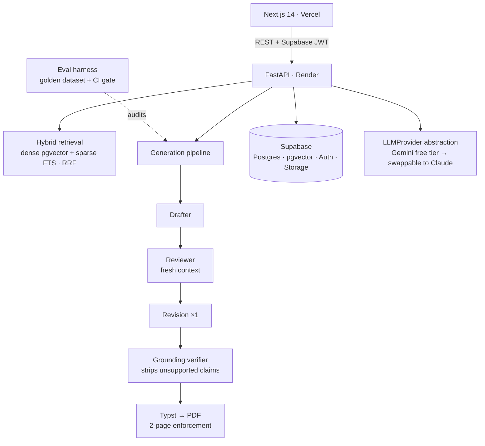

# JobPilot AU

**Grounded, evaluated AI job applications for the Australian graduate market.**
Every claim in a generated CV or cover letter is traced back to evidence in your
profile — and a 15-case evaluation harness proves the pipeline doesn't fabricate.

> **Live demo:** _add your Vercel URL here_ · **API:** _add your Render URL here_
>
> ⚠️ This is a **grounded drafting assistant with human review**, not an
> auto-applier. Always read and edit before you submit.

---

## Why this exists

There are a thousand AI CV generators, and almost none can answer the one
question that matters: _how do you know the output is true?_ JobPilot AU is built
around that question. It drafts tailored application documents from your real
profile, verifies every claim against the evidence that supports it, strips
anything unsupported, and measures the result on a golden dataset — so "it
doesn't make things up" is a number, not a promise.

## Headline metrics

From the latest mock evaluation run (`backend/evaluation/reports/latest.md`):

| Metric | Result |
|---|---|
| **Grounding rate** | **100%** of shipped claims trace to profile evidence |
| **Fabrication rate** | **0%** — no forbidden ("trap") skill ever leaked |
| **Keyword coverage** | **100%** of expected JD keywords surfaced |
| Cases | 15 (AU graduate/internship JD × reference profile) |

Grounding rate on real Gemini runs varies with the profile; the CI gate fails
any run below **85% grounding** or **above 0% fabrication**.

## Architecture



**The pieces that make it portfolio-grade:**

- **Drafter → Reviewer → Verifier pipeline.** The drafter writes only from
  retrieved profile evidence. A reviewer critiques the draft in a _fresh
  context_ (it never sees the profile, so it can't be biased into approving
  fabrications). One revision cycle follows, then a verifier audits each claim's
  cited evidence and **removes anything unsupported**.
- **Grounding verification** is the signature feature: every bullet/paragraph
  carries the profile-chunk ids it used, and the verifier produces a
  claim-by-claim report with a grounding rate. Unaudited claims are treated as
  unsupported and dropped — an unverified claim never ships.
- **Hybrid retrieval** fuses dense (pgvector cosine) and sparse (Postgres
  full-text) results with Reciprocal Rank Fusion.
- **Relevance-weighted cutting** keeps CVs to two pages by scoring each bullet
  (relevance × uniqueness × cover-letter-dependency) and cutting lowest-first,
  re-rendering with Typst until it fits.
- **Provider abstraction.** All generation goes through `LLMProvider`, so
  swapping Gemini for Claude is a one-line config change — and re-running the
  eval harness gives a clean before/after comparison.

## The evaluation layer (the differentiator)

`backend/evaluation/` is a regression-gated harness, mirroring how you'd test
any ML system:

- **Golden dataset** (`dataset/v1.json`): AU graduate/internship JDs paired with
  a fixed reference profile. Each case declares `expected_keywords`,
  `forbidden_claims` (skills the JD demands that the profile lacks — the
  **fabrication trap**), and a page ceiling.
- **Metrics per run**: grounding rate, fabrication rate, keyword coverage,
  length compliance, latency, and an estimated token/cost figure.
- **Regression gate**: a GitHub Action runs the harness in `--mock` mode
  (deterministic, no API keys, free) on every PR and **fails the build** if any
  forbidden claim leaks or grounding drops below 85%.

```bash
cd backend
python -m evaluation.harness --dataset v1 --mock      # free, deterministic
python -m evaluation.harness --dataset v1 --cases 5 --persist   # real Gemini run
```

Results land on the in-app **/evals** page (runs table + trend + per-case
breakdown) and as markdown in `evaluation/reports/`.

## Tech stack

- **Frontend:** Next.js 14 (App Router), TypeScript, Tailwind, shadcn/ui — Vercel
- **Backend:** FastAPI, Python 3.11, Pydantic v2 — Render (free tier)
- **Data:** Supabase — Postgres + pgvector + Auth + Storage
- **LLM:** Google Gemini free tier behind an `LLMProvider` abstraction
- **Jobs:** Adzuna API (AU) + manual JD paste (no Seek/LinkedIn scraping)
- **PDF:** Typst (single ~30MB binary, sub-second compiles — not LaTeX)

## Local development

```bash
# Backend
cd backend
python -m venv .venv && source .venv/bin/activate   # Windows: .venv\Scripts\activate
pip install -r requirements.txt
cp .env.example .env                                 # fill in keys
uvicorn main:app --reload --port 8000

# Frontend
cd frontend
npm install
cp .env.example .env.local                           # fill in keys
npm run dev
```

Full click-path (Supabase migrations, storage bucket, OAuth, Render + Vercel
deploy, auth redirect URLs) is in **[SETUP.md](./SETUP.md)**. Project
constitution and engineering rules are in **[CLAUDE.md](./CLAUDE.md)**.

Run the backend tests:

```bash
cd backend && python -m pytest -q
```

## Screenshots

_Add screenshots for the README:_

- Landing page (hero + grounding pitch)
- Job detail with the **grounding panel** (claims verified, unsupported struck through)
- **/evals** page (metrics table + trend)

## Operational notes

- **Free-tier cold starts:** the Render backend sleeps after ~15 min idle and
  cold-starts in ~50s. The UI shows a "waking the server…" state.
- **Rate limiting:** generation is capped at 10 documents/hour/user (four LLM
  calls per document on a free tier).
- **Gemini free-tier limits** (~10–15 RPM) are fine for personal use.

## Roadmap

1. Interview-prep module: likely questions from the JD + STAR-format answer
   scaffolds drawn from your real projects.
2. Swap `LLMProvider` to Claude (Sonnet) and publish the before/after eval
   comparison.
3. RAGAS/TruLens integration on the retrieval layer.
4. Daily Adzuna digest (GitHub Action): auto-score saved queries, email top
   matches.

---

Built as a flagship portfolio project: RAG, a multi-agent generation pipeline,
grounding verification, and a real LLM evaluation harness — the things that
distinguish an engineer who ships measured AI from one who ships a wrapper.
